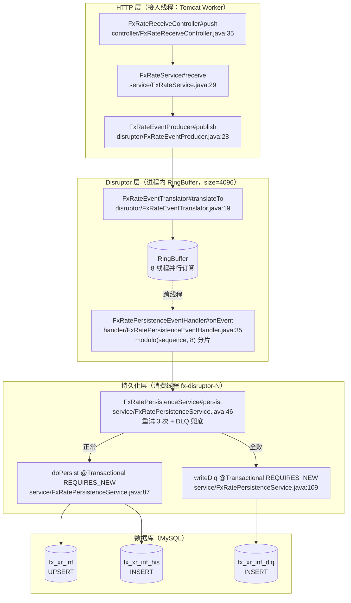
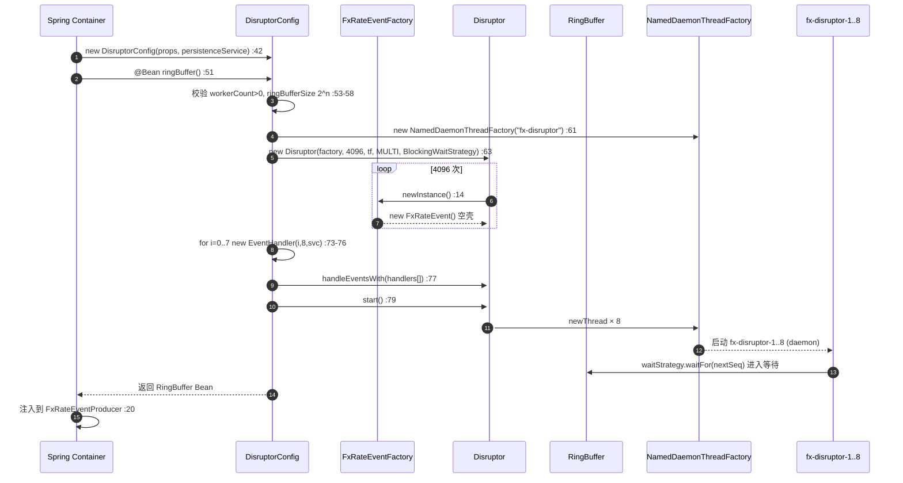
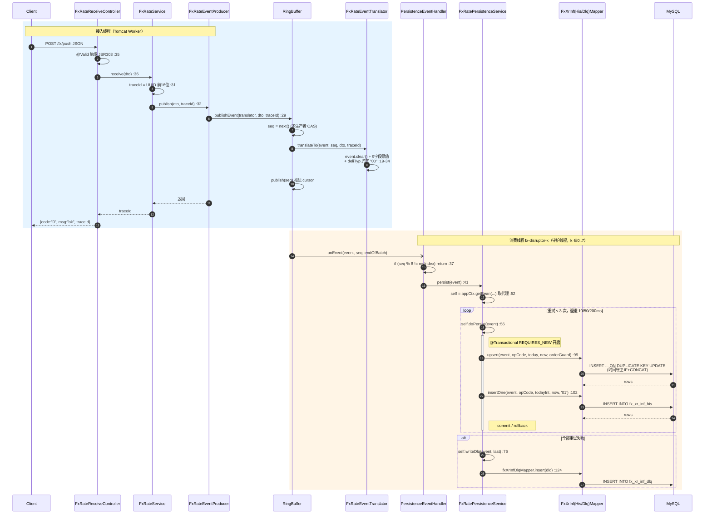
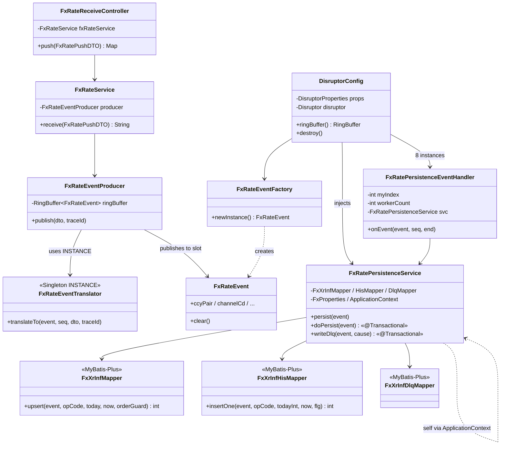
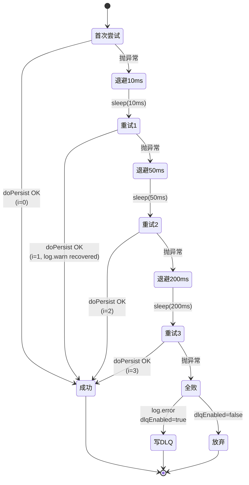
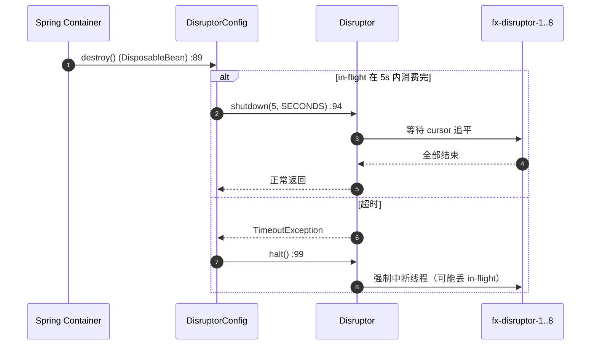

# fx-disruptor · /fx/push 全链路深度分析

> ⚠️ **本文描述的是 v1 同步单条落库路径**。当前架构已于 2026-04-30 升级为**双通道异步批量落库**，
> 消费侧 `FxRatePersistenceEventHandler` 不再同步调 `persist()`，改为入 `latestBuffer / historyBuffer`
> 由 `FxRateLatestFlusher / FxRateHistoryFlusher` 定时批量落库。
> 改造详情见 [`fx-async-batch-persist_20260430.md`](fx-async-batch-persist_20260430.md)。
> 本文保留作为 v1 路径的逐行参考（上游 / Producer / 重试 / DLQ 逻辑依然一致）。

---

> 版本：2026-04-27 · v1
> 范围：自 HTTP 入口 `POST /fx/push` 起，至 MyBatis Mapper XML SQL 止（不下探至 MySQL InnoDB 层）
> 阅读目标：新人 / 自学者能沿着 `path:line` 锚点在 IDE 内点跳跳读全流程

---

## 1. 系统概述

### 1.1 功能定位

承接银行侧实时汇率推送（峰值 ≈ 1000 QPS，100 货币对 × 10 渠道）。
单条路径要求：

- 主表 `fx_xr_inf` 实时 UPSERT（供在线查询用）
- 历史表 `fx_xr_inf_his` 单行 INSERT（全量流水）

禁止本地攒批 —— 主表必须实时可查。

### 1.2 技术栈版本


| 组件                  | 版本                                                 | 锚点              |
| --------------------- | ---------------------------------------------------- | ----------------- |
| JDK                   | 17                                                   | `pom.xml:19-21`   |
| Spring Boot           | 2.7.18（`spring-boot-starter-parent`）               | `pom.xml:7-13`    |
| LMAX Disruptor        | 4.0.0                                                | `pom.xml:108-111` |
| MyBatis-Plus          | 3.5.2                                                | `pom.xml:25`      |
| maven-compiler-plugin | 3.13.0（显式固定，覆盖 parent 2.3.2）                | `pom.xml:137-154` |
| 校验                  | spring-boot-starter-validation +`javax.validation.*` | `pom.xml:113-116` |

### 1.3 架构分层



### 1.4 线程模型


| 线程                                | 来源                                                    | 作用域                                                           |
| ----------------------------------- | ------------------------------------------------------- | ---------------------------------------------------------------- |
| **接入线程** `http-nio-8080-exec-N` | Tomcat 线程池                                           | 跑 Controller → Service → Producer →`ringBuffer.publishEvent` |
| **消费线程** `fx-disruptor-1..8`    | `DisruptorConfig.java:61` 的 `NamedDaemonThreadFactory` | 每个绑定一个 EventHandler，跑落库 SQL                            |
| **线程切换点**                      | `ringBuffer.publishEvent(...)` 返回时（生产者线程释放） | 到 Handler`onEvent` 被回调时（消费者线程接续）                   |

关键含义：**接入线程在 publishEvent 返回后就可以响应 HTTP**，落库在后台消费线程完成。

---

## 2. 启动装配 · Disruptor Bean 生命周期

### 2.1 Spring 容器启动入口

`Application.java:27`

```java
ConfigurableApplicationContext context = SpringApplication.run(Application.class, args);
```

`@SpringBootApplication` (`Application.java:16`) 触发包扫描，`com.hayes.base.fx.config.DisruptorConfig` 作为 `@Configuration` 被加载（`DisruptorConfig.java:34`）。

### 2.2 `DisruptorConfig#ringBuffer()` 逐行拆解

这是整个系统的"装配心脏"，`@Bean` 返回的 `RingBuffer` 会被 Spring 作为容器 Bean 注册，供 `FxRateEventProducer.java:20` 构造注入。


| 行号                      | 代码                                                                                                  | 作用                                                                                           |
| ------------------------- | ----------------------------------------------------------------------------------------------------- | ---------------------------------------------------------------------------------------------- |
| `DisruptorConfig.java:52` | `int workerCount = props.getWorkerCount();`                                                           | 读`app.disruptor.worker-count=8`（`application.yml:48`）                                       |
| `:53-55`                  | `workerCount <= 0` 校验                                                                               | 配置失误防御                                                                                   |
| `:56-58`                  | `Integer.bitCount(ringBufferSize) != 1` 校验                                                          | RingBuffer size 必须 2 的幂 —— Disruptor 用位运算`seq & (size-1)` 取槽位下标，非 2 幂会失败  |
| `:61`                     | `ThreadFactory threadFactory = new NamedDaemonThreadFactory("fx-disruptor");`                         | 命名线程便于 jstack/arthas 识别（实现见`:119-133`）                                            |
| `:63-69`                  | `disruptor = new Disruptor<>(factory, 4096, threadFactory, ProducerType.MULTI, BlockingWaitStrategy)` | **关键构造**，见下表                                                                         |
| `:73-76`                  | 循环`new FxRatePersistenceEventHandler(i, 8, persistenceService)`                                     | 构造 8 个 handler，每个携带自己的`myIndex ∈ [0,7]`                                            |
| `:77`                     | `disruptor.handleEventsWith(handlers)`                                                                | **并行**订阅 —— 8 handler 都看到全部序列流（详见 §6.1）                                     |
| `:79`                     | `disruptor.start()`                                                                                   | ThreadFactory 实际产生 8 条线程，每条绑定一个 handler 进入`waitStrategy.waitFor(seq)` 等待循环 |
| `:82`                     | `return disruptor.getRingBuffer();`                                                                   | 作为 Spring Bean 返回，供 Producer 注入                                                        |

Disruptor 构造五参数的含义（`DisruptorConfig.java:63-69`）：


| 参数                        | 值                         | 解释                                                               |
| --------------------------- | -------------------------- | ------------------------------------------------------------------ |
| `EventFactory<FxRateEvent>` | `new FxRateEventFactory()` | 见 §2.3                                                           |
| `ringBufferSize`            | 4096                       | 约 4 秒的 1000 QPS 缓冲                                            |
| `ThreadFactory`             | `NamedDaemonThreadFactory` | **Disruptor 4.0.0 移除了 Executor 构造**，必须传 `ThreadFactory` |
| `ProducerType`              | `MULTI`                    | 多生产者安全（Tomcat 多线程并发 publishEvent 需要 CAS 抢序号）     |
| `WaitStrategy`              | `BlockingWaitStrategy`     | Ring 满时阻塞生产者，形成**对 MySQL 的天然背压**（见 §8）         |

### 2.3 RingBuffer 槽位预填充原理

`FxRateEventFactory.java:11-17`

```java
public class FxRateEventFactory implements EventFactory<FxRateEvent> {
    @Override
    public FxRateEvent newInstance() {
        return new FxRateEvent();
    }
}
```

Disruptor 构造函数内部会循环调 4096 次 `newInstance()`，把 4096 个空的 `FxRateEvent` 填满环形数组的每个槽位。

**这是 Disruptor 性能核心**：运行期不再 new 对象，所有事件在 Ring 里**循环复用**。代价：槽位残留旧字段，需要在 `FxRateEvent.java:58-70` 的 `clear()` 方法里显式清空，且 `FxRateEventTranslator.java:21` 在填充前先调 `event.clear()`。

### 2.4 ThreadFactory 与 8 条消费线程启动

`DisruptorConfig.java:119-133`

```java
private static class NamedDaemonThreadFactory implements ThreadFactory {
    private final String prefix;
    private final AtomicInteger seq = new AtomicInteger();

    @Override
    public Thread newThread(Runnable r) {
        Thread t = new Thread(r, prefix + "-" + seq.incrementAndGet());
        t.setDaemon(true);  // 守护线程：JVM 退出时不阻塞
        return t;
    }
}
```

`disruptor.start()` 内部会对每个 EventHandler 调一次 `threadFactory.newThread(...)`，因此**恰好启动 8 条**名为 `fx-disruptor-1..8` 的守护线程。每条线程进入 "等待 sequence 推进 → 调 handler.onEvent" 的无限循环。

### 2.5 启动装配时序图



---

## 3. 请求处理主流程 · /fx/push 逐跳拆解

### 3.1 接入阶段 · Controller → Service → Producer

**入口** `FxRateReceiveController.java:34-43`

```java
@PostMapping("/push")
public Map<String, Object> push(@RequestBody @Valid FxRatePushDTO dto) {
    String traceId = fxRateService.receive(dto);
    Map<String, Object> resp = new HashMap<>(3);
    resp.put("code", "0");
    resp.put("msg", "ok");
    resp.put("traceId", traceId);
    return resp;
}
```

- `@RequestBody` 触发 Jackson JSON → `FxRatePushDTO` 反序列化
- `@Valid` 触发 JSR303 校验（基于 `javax.validation`），任一约束不满足立即抛 `MethodArgumentNotValidException`，事件根本不会进入 RingBuffer
- 校验规则见 `FxRatePushDTO.java:17-57`，如 `@NotBlank ccyPair (:22)`、`@Size(min=8, max=8) dtChannelPublish (:47)`

**接入 Service** `FxRateService.java:29-38`

```java
public String receive(FxRatePushDTO dto) {
    String traceId = UUID.randomUUID().toString().replace("-", "").substring(0, 16);
    producer.publish(dto, traceId);
    ...
    return traceId;
}
```

- traceId 在**进入 RingBuffer 前**生成，用于贯穿 HTTP → 消费线程 → DB 日志

**发布器** `FxRateEventProducer.java:28-30`

```java
public void publish(FxRatePushDTO dto, String traceId) {
    ringBuffer.publishEvent(FxRateEventTranslator.INSTANCE, dto, traceId);
}
```

### 3.2 RingBuffer 发布 · `publishEvent` 三步展开

`ringBuffer.publishEvent(translator, dto, traceId)` 是 Disruptor 对"声明式发布"的封装，内部等价于：

```java
long seq = ringBuffer.next();              // 1) 抢序号（MULTI 下 CAS；BlockingWait 下 Ring 满会阻塞）
try {
    FxRateEvent event = ringBuffer.get(seq); // 2) 取槽位对象（预填充的空壳）
    translator.translateTo(event, seq, dto, traceId);  // 填充字段
} finally {
    ringBuffer.publish(seq);               // 3) 推进 cursor，消费者可见
}
```

**Translator 填槽** `FxRateEventTranslator.java:19-34`

```java
public void translateTo(FxRateEvent event, long sequence, FxRatePushDTO dto, String traceId) {
    event.clear();                                            // 清旧槽位
    event.setCcyPair(dto.getCcyPair());
    event.setChannelCd(dto.getChannelCd());
    event.setBuyPrice(dto.getBuyPrice());
    event.setSellPrice(dto.getSellPrice());
    event.setBlPrice(dto.getBlPrice());
    event.setDeliTyp(StringUtils.defaultIfBlank(              // 兜底 "00"
        dto.getDeliTyp(), FxConst.DEFAULT_DELI_TYP));
    event.setDtChannelPublish(dto.getDtChannelPublish());
    event.setTmChannelPublish(dto.getTmChannelPublish());
    event.setUtcTimes(dto.getUtcTimes());
    event.setReceiveNanos(System.nanoTime());                 // 监控打点
    event.setTraceId(traceId);
}
```

两个细节：

1. `event.clear()` 是**必须的**。同一槽位在 Ring 绕一圈后会复用，上次的 `blPrice`/`utcTimes` 可能残留。
2. `deliTyp` 兜底（`FxRateEventTranslator.java:28`）对齐 HARD-GATE Q-D 决策（默认 "00" TOD），同时 `FxRatePersistenceService.java:94-96` 在消费线程里再兜底一次做防御编程。

### 3.3 跨线程边界

`ringBuffer.publish(seq)` 执行完，**接入线程释放**。8 条 `fx-disruptor-N` 消费线程中的某一条（满足 `seq % 8 == myIndex` 的那条）会被 `BlockingWaitStrategy` 唤醒，回调 `onEvent`。

从 HTTP 视角看：只要 RingBuffer 没满，`receive(dto)` 延迟就是纳秒级。

### 3.4 消费阶段 · Handler modulo 分片

`FxRatePersistenceEventHandler.java:35-47`

```java
@Override
public void onEvent(FxRateEvent event, long sequence, boolean endOfBatch) {
    if ((sequence % workerCount) != myIndex) {   // 分片过滤
        return;
    }
    try {
        persistenceService.persist(event);
    } catch (Throwable ex) {
        log.error("[fx-rate] handler#{} 未预期异常 ...", myIndex, ex);   // 兜底：异常不能冒出，否则整条 Disruptor 会停
    }
}
```

**为什么要 modulo 过滤？** 见 §6.1。核心：Disruptor 4.0.0 移除了 `WorkerPool`，要自己用"并行订阅 + 取模分片"等价实现。

**为什么要 try/catch Throwable？** Disruptor 的 `BatchEventProcessor` 默认行为：handler 抛出未被 `ExceptionHandler` 捕获的异常时整个 processor 会停掉。Service 内部已有重试+DLQ，这里再加一道兜底防雪崩。

### 3.5 持久化阶段 · 自注入 + 事务边界

`FxRatePersistenceService.java:46-81` 入口：

```java
public void persist(FxRateEvent event) {
    int attempts = fxProps.getRetryTimes() + 1;       // 首次 + 3 次重试 = 4 次
    List<Long> backoff = fxProps.getRetryBackoffMsList();   // [10, 50, 200]
    Throwable last = null;

    // 关键：通过 ApplicationContext 拿到自己的代理对象
    FxRatePersistenceService self = appCtx.getBean(FxRatePersistenceService.class);

    for (int i = 0; i < attempts; i++) {
        try {
            self.doPersist(event);       // 走代理，@Transactional 才会生效
            if (i > 0) {
                log.warn("[fx-rate] persist recovered after {} retries. traceId={}", i, event.getTraceId());
            }
            return;
        } catch (Throwable ex) {
            last = ex;
            log.warn("[fx-rate] persist attempt {}/{} failed. traceId={} reason={}",
                    i + 1, attempts, event.getTraceId(), ex.getMessage());
            if (i < attempts - 1) {
                sleepQuietly(backoff.get(Math.min(i, backoff.size() - 1)));
            }
        }
    }
    // 全败分支
    log.error("[fx-rate] persist FINALLY failed after {} attempts. ...", attempts, ...);
    if (fxProps.isDlqEnabled()) {
        try { self.writeDlq(event, last); } catch (Throwable dlqEx) { log.error(...); }
    }
}
```

**事务边界方法** `FxRatePersistenceService.java:86-103`

```java
@Transactional(rollbackFor = Throwable.class, propagation = Propagation.REQUIRES_NEW)
public void doPersist(FxRateEvent event) {
    String opCode = fxProps.getOpCode();          // "SYS_FX_RATE"
    String today = FxTimeUtils.today();           // "20260427"
    String now = FxTimeUtils.now();               // "153045"
    int todayInt = FxTimeUtils.todayInt();        // 20260427 (int)

    if (StringUtils.isBlank(event.getDeliTyp())) {
        event.setDeliTyp(fxProps.getDefaultDeliTyp());   // 防御式兜底
    }

    fxXrInfMapper.upsert(event, opCode, today, now, fxProps.isOrderGuardEnabled());
    fxXrInfHisMapper.insertOne(event, opCode, todayInt, now, FxConst.SUCC_FLG_SUCCESS);
}
```

`REQUIRES_NEW` 的语义：**每次重试启一个全新事务**，前一次失败的回滚不影响下一次。两条 SQL 要么都提交要么都回滚，不会出现"主表更新了但 HIS 没插入"。

### 3.6 UPSERT 时间守卫 SQL 详解

`FxXrInfMapper.xml:16-69`

```sql
INSERT INTO fx_xr_inf (
    CCY_PAIR, CHANNEL_CD, BUY_PRICE, SELL_PRICE, BL_PRICE,
    OP_CTE, DT_CTE, TM_CTE, OP_UTE, DT_UTE, TM_UTE,
    DT_CHANNEL_PUBLISH, TM_CHANNEL_PUBLISH, DELI_TYP, UTC_TIMES
) VALUES (
    #{e.ccyPair}, #{e.channelCd}, #{e.buyPrice}, #{e.sellPrice}, #{e.blPrice},
    #{opCode}, #{today}, #{now}, #{opCode}, #{today}, #{now},
    #{e.dtChannelPublish}, #{e.tmChannelPublish}, #{e.deliTyp}, #{e.utcTimes}
)
ON DUPLICATE KEY UPDATE
    BUY_PRICE = IF(
        CONCAT(VALUES(DT_CHANNEL_PUBLISH), VALUES(TM_CHANNEL_PUBLISH))
        >= CONCAT(DT_CHANNEL_PUBLISH, TM_CHANNEL_PUBLISH),
        VALUES(BUY_PRICE), BUY_PRICE
    ),
    SELL_PRICE = IF(..., VALUES(SELL_PRICE), SELL_PRICE),
    ...
```

**行为矩阵**：


| 情况                                  | 唯一键`(CHANNEL_CD, CCY_PAIR, DELI_TYP)` | orderGuard | 结果                                                           |
| ------------------------------------- | ---------------------------------------- | ---------- | -------------------------------------------------------------- |
| 首次到达                              | 未命中                                   | 任意       | INSERT 新行                                                    |
| 已存在，新发布时间 ≥ 现存            | 命中                                     | true       | UPDATE 全部字段                                                |
| 已存在，新发布时间 < 现存（旧覆盖新） | 命中                                     | true       | **IF 判断 false**，UPDATE 退化为"字段赋值给自己"，业务字段不变 |
| 已存在                                | 命中                                     | false      | 无条件覆盖                                                     |

`orderGuard=true` 由 `application.yml:59 order-guard-enabled: true` 驱动，对应 HARD-GATE Q-B。

### 3.7 HIS 表 INSERT

`FxXrInfHisMapper.xml:7-17`

```sql
INSERT INTO fx_xr_inf_his (
    CCY_PAIR, CHANNEL_CD, BUY_PRICE, SELL_PRICE, BL_PRICE,
    OP_CTE, DT_CTE, TM_CTE,
    DT_CHANNEL_PUBLISH, TM_CHANNEL_PUBLISH, SUCC_FLG, DELI_TYP, UTC_TIMES
) VALUES (...)
```

注意 `#{todayInt}` 传的是 `int`（`FxTimeUtils.java:26 todayInt()`），对应 `his.DT_CTE int` 字段类型 —— 与主表 `inf.DT_CTE varchar(8)` 不同，必须区分传参。

### 3.8 失败分支 · 重试指数退避 → DLQ

见 §6.3 状态机图。退避序列 `10,50,200` (ms) 读自 `application.yml:63`，由 `FxProperties.java:35-41 getRetryBackoffMsList()` 逗号分隔解析为 `List<Long>`。

`writeDlq` `FxRatePersistenceService.java:108-125`：独立事务，构造 `FxXrInfDlq` 实体（`entity/FxXrInfDlq.java`），异常消息截断至 1000 字符（`:121`），`BaseMapper#insert` 落 `fx_xr_inf_dlq` 表。

### 3.9 主流程时序图



---

## 4. 核心数据结构

### 4.1 FxRatePushDTO（入参 · `dto/FxRatePushDTO.java`）


| 字段               | 约束                           | 行号     | 业务含义               |
| ------------------ | ------------------------------ | -------- | ---------------------- |
| `ccyPair`          | `@NotBlank @Size(max=7)`       | `:20-22` | 货币对 USDCNY          |
| `channelCd`        | `@NotBlank @Size(max=8)`       | `:25-27` | 通道编号 BOC/CMB 等    |
| `buyPrice`         | `@NotNull BigDecimal`          | `:30-31` | 买入价                 |
| `sellPrice`        | `@NotNull BigDecimal`          | `:34-35` | 卖出价                 |
| `blPrice`          | 可空                           | `:38`    | 彭博价                 |
| `deliTyp`          | `@Size(max=2)` 可空            | `:41-42` | 交割类型，空→"00" TOD |
| `dtChannelPublish` | `@NotBlank @Size(min=8,max=8)` | `:45-47` | 渠道发布日 YYYYMMDD    |
| `tmChannelPublish` | `@NotBlank @Size(min=6,max=6)` | `:50-52` | 渠道发布时分秒 HHmmss  |
| `utcTimes`         | `@Size(max=32)` 可空           | `:55-56` | UTC 时间戳串           |

### 4.2 FxRateEvent（RingBuffer 槽 · `disruptor/FxRateEvent.java`）

两类字段分开定义：

- **业务字段**（映射 DB，`:20-45`）：`ccyPair / channelCd / buyPrice / sellPrice / blPrice / deliTyp / dtChannelPublish / tmChannelPublish / utcTimes`
- **运行时字段**（不入库，`:49-53`）：`receiveNanos`（端到端延迟统计）、`traceId`（链路追踪）

`clear()` 方法 (`:58-70`) 是 Disruptor 复用模式的**强约定**。Translator 在 `:21` 先调 `clear()` 再赋值。

### 4.3 三表 Entity 与类型差异


| Entity            | 表              | 关键差异点                                                                            |
| ----------------- | --------------- | ------------------------------------------------------------------------------------- |
| `FxXrInf.java`    | `fx_xr_inf`     | `dtCte / dtUte / dtChannelPublish` 均为 `String`（varchar(8)）                        |
| `FxXrInfHis.java` | `fx_xr_inf_his` | **`dtCte: Integer`**（`entity/FxXrInfHis.java:44`）—— 对应 DDL `DT_CTE int`，分区键 |
| `FxXrInfDlq.java` | `fx_xr_inf_dlq` | 多出`traceId / failReason / dtCte varchar / tmCte varchar`                            |

### 4.4 数据流字段映射图

```mermaid
flowchart LR
    subgraph JSON["HTTP JSON"]
        J["{ccyPair, channelCd,<br/>buyPrice, sellPrice,<br/>blPrice, deliTyp,<br/>dtChannelPublish,<br/>tmChannelPublish,<br/>utcTimes}"]
    end

    subgraph DTO["FxRatePushDTO (dto/FxRatePushDTO.java)"]
        D["@NotBlank ccyPair :22<br/>@NotBlank channelCd :27<br/>@NotNull buyPrice :31<br/>@NotNull sellPrice :35<br/>blPrice :38<br/>@Size(max=2) deliTyp :42<br/>@Size(8,8) dtChannelPublish :47<br/>@Size(6,6) tmChannelPublish :52<br/>utcTimes :56"]
    end

    subgraph EV["FxRateEvent (disruptor/FxRateEvent.java)"]
        E["ccyPair / channelCd / buyPrice /<br/>sellPrice / blPrice /<br/>deliTyp (空→'00') / dtChannelPublish /<br/>tmChannelPublish / utcTimes<br/>+ receiveNanos (监控)<br/>+ traceId (追踪)"]
    end

    subgraph SQL1["UPSERT 主表 (FxXrInfMapper.xml:16-69)"]
        S1["CCY_PAIR, CHANNEL_CD,<br/>BUY_PRICE, SELL_PRICE, BL_PRICE,<br/>DELI_TYP, UTC_TIMES,<br/>DT_CHANNEL_PUBLISH, TM_CHANNEL_PUBLISH,<br/>OP_CTE/DT_CTE/TM_CTE/OP_UTE/DT_UTE/TM_UTE<br/>(SYS_FX_RATE / today / now)"]
    end

    subgraph SQL2["INSERT HIS (FxXrInfHisMapper.xml:7-17)"]
        S2["同上 9 业务字段<br/>+ DT_CTE int (todayInt)<br/>+ SUCC_FLG '01'"]
    end

    J -->|Jackson + @Valid| D
    D -->|Translator.translateTo :19-34| E
    E -->|#{e.xxx} + opCode/today/now| S1
    E -->|#{e.xxx} + opCode/todayInt/now| S2
```

---

## 5. 关键路径总览

### 5.1 核心类图



---

## 6. 控制流专题

### 6.1 modulo 分片为何等价于 WorkerPool

Disruptor **3.x 时代**的做法：

```java
WorkerPool<FxRateEvent> pool = new WorkerPool<>(eventFactory, exceptionHandler, handler1, handler2, ...);
```

`WorkerPool` 内部保证：**每条事件恰好被一个 WorkHandler 处理**（基于共享 `workSequence` 的 CAS 抢占）。

**Disruptor 4.0.0 移除了 `WorkerPool` 和 `WorkHandler`** 。替代方案：`handleEventsWith(h0, h1, ..., hN-1)` 是**并行**订阅（每个 handler 都看到全部 sequence 流），此时要在每个 handler 里过滤：

```java
if ((sequence % workerCount) != myIndex) return;   // FxRatePersistenceEventHandler.java:37
```

效果：

- 8 个 handler 并行；序号 0 归 handler#0，序号 1 归 handler#1，…，序号 8 归 handler#0（循环）
- 任一序号恰被一个 handler 真正处理，其余 7 个 handler 立即 `return`（成本：空调用 + 取模）
- **语义上等价于 WorkerPool**，性能代价是"空回调"开销，对 1k QPS 可忽略

### 6.2 Spring 自注入绕过 `this` 调用失效

`FxRatePersistenceService.java:40-42`

```java
/** 自注入以保证 @Transactional 生效（内部方法调用要走代理） */
private final org.springframework.context.ApplicationContext appCtx;
```

`:52`

```java
FxRatePersistenceService self = appCtx.getBean(FxRatePersistenceService.class);
```

**为什么不能写 `this.doPersist(event)`？**

Spring `@Transactional` 的实现是**AOP 代理**：容器注入到调用方的是代理对象，代理在方法前后插入事务开启/提交/回滚。`this` 指的是目标对象本身，绕开了代理，`@Transactional` 不会生效。

本类 `persist` → `this.doPersist` 就是这种"**自调用**"，一定失效。解法：


| 方案                                                   | 评价                                              |
| ------------------------------------------------------ | ------------------------------------------------- |
| `ApplicationContext.getBean(自己.class)` ✅ 本项目用此 | 代码直观，不依赖构造顺序                          |
| 构造注入自己                                           | 2.6+ 默认禁止循环依赖，需加`@Lazy`                |
| 抽成单独`@Service`                                     | 多一层类，语义分散                                |
| `AopContext.currentProxy()`                            | 需开启`@EnableAspectJAutoProxy(exposeProxy=true)` |

### 6.3 重试状态机



最坏总耗时 ≈ 10 + 50 + 200 = 260 ms（不含 SQL 执行时间）。被 `Thread.sleep` 阻塞的是某条 `fx-disruptor-N` 消费线程，其它 7 条不受影响。

### 6.4 时间守卫 SQL 字典序 == 时间序的安全性

`FxXrInfMapper.xml:29-30`

```sql
IF(CONCAT(VALUES(DT_CHANNEL_PUBLISH), VALUES(TM_CHANNEL_PUBLISH))
   >= CONCAT(DT_CHANNEL_PUBLISH, TM_CHANNEL_PUBLISH), ...)
```

- `DT_CHANNEL_PUBLISH` 是 8 位定长 YYYYMMDD
- `TM_CHANNEL_PUBLISH` 是 6 位定长 HHmmss
- 拼接后是 14 位定长字符串，**字典序严格等于时间序**

证明要点：

1. 定长不需要 padding，"20260427120000" < "20260427120001" 字典序 ≡ 时间序
2. 不存在类似 "1" < "12" 的定长矛盾（输入校验 `@Size(8,8) @Size(6,6)` 保证在 `FxRatePushDTO.java:47,52`）

---

## 7. 容器关闭时序 · 优雅停机

`DisruptorConfig.java:88-101`

```java
@Override
public void destroy() {
    if (disruptor == null) return;
    try {
        disruptor.shutdown(props.getShutdownTimeoutSeconds(), TimeUnit.SECONDS);
        log.info("[fx-disruptor] shutdown gracefully.");
    } catch (Exception ex) {
        log.warn("[fx-disruptor] shutdown timeout after {}s, force halt.", props.getShutdownTimeoutSeconds(), ex);
        disruptor.halt();
    }
}
```

关闭时序：



关键点：

- 实现 `DisposableBean#destroy()`（`DisruptorConfig.java:36 implements DisposableBean`）使得 **Spring 关闭容器时自动回调**，无需注册 JVM 钩子。
- `shutdown(5s)` 会**等待 RingBuffer 消费到 cursor 末尾**；若 5 秒内完不成（例如 DB 卡死），会抛 `TimeoutException`。
- `halt()` 强行中断 handler 线程，尚未消费的 in-flight 事件**丢失** —— 这是容量规划的下限：关闭前已在 Ring 中但未落库的数据。
- 消费线程都是 `daemon=true`（`DisruptorConfig.java:131`），JVM 退出时即使没来得及清理也不会卡住。

---

## 8. 设计亮点

1. **BlockingWaitStrategy 的天然背压**
   `DisruptorConfig.java:111 case "blocking" -> new BlockingWaitStrategy();` 选择此策略后，Ring 满时 `ringBuffer.next()` 阻塞生产者。MySQL 抖动 → 消费慢 → Ring 填满 → HTTP 线程阻塞 → Tomcat 自然限流。无需额外限流组件。
2. **Event 复用 + clear() 防脏数据**
   Disruptor 运行期零对象分配，但代价是槽位残留。`FxRateEvent.java:58 clear()` + `FxRateEventTranslator.java:21 event.clear()` 的"先清后填"约定消除脏数据风险。
3. **REQUIRES_NEW + 自注入组合**
   重试每一次都是一次全新事务（`FxRatePersistenceService.java:86`），避免"外层事务已标记 rollback-only 导致内层提交失败"。`ApplicationContext.getBean()` 自注入（`:52`）确保调用走代理。
4. **时间守卫利用 MySQL `VALUES()` 函数**
   `VALUES(col)` 在 `ON DUPLICATE KEY UPDATE` 分支中返回 INSERT 语句尝试插入的值，配合定长字符串字典序特性，单条 SQL 完成"比时间戳决定是否覆盖"的逻辑，免去先 SELECT 再 UPDATE 的两轮交互。
5. **两阶段兜底 deliTyp 默认值**
   `FxRateEventTranslator.java:28`（入队前）+ `FxRatePersistenceService.java:94-96`（落库前）。前者处理正常 HTTP 入口；后者处理将来可能直接往 RingBuffer 投事件的其它入口。

---

## 9. 潜在问题与改进建议


| 级别      | 问题                                                                    | 建议                                                                                                                         |
| --------- | ----------------------------------------------------------------------- | ---------------------------------------------------------------------------------------------------------------------------- |
| 🔴 风险   | Spring Boot 2.2.0 已 EOL（2020-10 停维护）                              | 升级到 SB 3.x（需`javax` → `jakarta` 迁移，仅 `FxRatePushDTO.java:3-5` 与 `FxRateReceiveController.java:5` 共 4 行 import） |
| 🟡 性能   | modulo 分片的空回调成本：每条事件 8 handler 都会被回调 7 次空 return    | 1k QPS 下可忽略；若到 10k QPS 再考虑`RingBuffer.hasAvailableCapacity` / 分多个 `EventProcessor` 各自 `SequenceBarrier`       |
| 🟡 可观测 | 无监控指标（Ring 剩余容量 / persist 延迟 / DLQ 计数）                   | 补 Micrometer：`ringBuffer.remainingCapacity()` 定时打点，`doPersist` StopWatch，DLQ 插入 counter                            |
| 🟡 告警   | DLQ 表写入无告警机制                                                    | 建表时加 Canal/Debezium 监听 + 企业微信/钉钉；或定时扫表 COUNT > 0                                                           |
| 🟢 一致性 | `FxRateEventTranslator` 和 `FxRatePersistenceService` 都做 deliTyp 兜底 | 当前设计为防御式，可接受；若想消除重复，把兜底集中到`doPersist`，但失去入队前归一化的好处                                    |
| 🟢 可扩展 | 上游协议未来可能切 Kafka                                                | 新建`FxRateKafkaConsumer` 调 `FxRateService.receive(dto)` 即可，RingBuffer 下游无需改                                        |

---

## 10. 维护性评估


| 维度     | 评分       | 说明                                                                                                              |
| -------- | ---------- | ----------------------------------------------------------------------------------------------------------------- |
| 单一职责 | ⭐⭐⭐⭐⭐ | 每个类职责清晰：Controller 仅接入、Service 仅调度、Translator 仅翻译、Handler 仅分片、PersistenceService 仅持久化 |
| 配置化   | ⭐⭐⭐⭐⭐ | `DisruptorProperties` / `FxProperties` 完整覆盖 ring 大小、worker 数、重试、DLQ 开关                              |
| 可测试性 | ⭐⭐⭐⭐   | Service 都是 POJO 可 mock；唯一缺点：`ApplicationContext` 自注入在测试里需要手工塞 `ApplicationContextAware` 的桩 |
| 可观测性 | ⭐⭐⭐     | 日志点齐全（warn/error/recovered），但**无 metrics** —— 见 §9                                                  |
| 新人上手 | ⭐⭐⭐⭐   | 每个类/方法都有中文 Javadoc，配合本文档可完整追踪链路                                                             |
| 扩展性   | ⭐⭐⭐⭐⭐ | 接入通道切换（HTTP → Kafka）零改动下游；新通道只需调`FxRateService.receive`                                      |

---

## 附录 A · 全链路调用链速查表

```
[HTTP Worker]
  FxRateReceiveController#push               controller/FxRateReceiveController.java:35
  └─ FxRateService#receive                   service/FxRateService.java:29
     └─ FxRateEventProducer#publish          disruptor/FxRateEventProducer.java:28
        └─ RingBuffer#publishEvent (Disruptor 4.0.0 内部)
           ├─ next()            抢 sequence（MULTI CAS / Blocking 阻塞）
           ├─ FxRateEventTranslator#translateTo    disruptor/FxRateEventTranslator.java:19
           │   └─ FxRateEvent#clear          disruptor/FxRateEvent.java:58
           └─ publish(seq)      推进 cursor

~~~ 跨线程 ~~~

[fx-disruptor-k , k ∈ 0..7]
  FxRatePersistenceEventHandler#onEvent      disruptor/handler/FxRatePersistenceEventHandler.java:35
  └─ (seq % 8 == myIndex)?  N: return
     Y↓
     FxRatePersistenceService#persist        service/FxRatePersistenceService.java:46
     ├─ appCtx.getBean(self)                 :52
     ├─ loop i∈[0..3]
     │   └─ self.doPersist(event)            :56  → 代理 → :87
     │      @Transactional REQUIRES_NEW
     │      ├─ FxXrInfMapper#upsert          mapper/FxXrInfMapper.java:28
     │      │   └─ xml INSERT...ON DUPLICATE KEY UPDATE   mapper/FxXrInfMapper.xml:16-69
     │      └─ FxXrInfHisMapper#insertOne    mapper/FxXrInfHisMapper.java:25
     │          └─ xml INSERT HIS            mapper/FxXrInfHisMapper.xml:7-17
     │
     └─ (全败)
        self.writeDlq(event, last)           :76  → 代理 → :109
        @Transactional REQUIRES_NEW
        └─ FxXrInfDlqMapper.insert(dlq)       MP BaseMapper → fx_xr_inf_dlq
```

## 附录 B · 配置速查表（`application.yml:43-65`）


| 键                                       | 默认值      | 作用                                 | 代码绑定                                                             |
| ---------------------------------------- | ----------- | ------------------------------------ | -------------------------------------------------------------------- |
| `app.disruptor.ring-buffer-size`         | 4096        | RingBuffer 容量（2 的幂）            | `DisruptorProperties.java:14`                                        |
| `app.disruptor.worker-count`             | 8           | 并行消费 handler 数                  | `DisruptorProperties.java:17`                                        |
| `app.disruptor.wait-strategy`            | blocking    | blocking/yielding/busy-spin/sleeping | `DisruptorProperties.java:20`, 解析见 `DisruptorConfig.java:106-114` |
| `app.disruptor.shutdown-timeout-seconds` | 5           | 优雅停机超时                         | `DisruptorProperties.java:23`                                        |
| `app.fx.op-code`                         | SYS_FX_RATE | 操作人编号常量（HARD-GATE Q-A）      | `FxProperties.java:17`                                               |
| `app.fx.default-deli-typ`                | "00"        | 交割类型兜底（HARD-GATE Q-D）        | `FxProperties.java:20`                                               |
| `app.fx.order-guard-enabled`             | true        | 启用时间守卫（HARD-GATE Q-B）        | `FxProperties.java:23`                                               |
| `app.fx.retry-times`                     | 3           | 重试次数（不含首次）                 | `FxProperties.java:26`                                               |
| `app.fx.retry-backoff-ms`                | "10,50,200" | 指数退避序列                         | `FxProperties.java:29`，解析 `:35-41`                                |
| `app.fx.dlq-enabled`                     | true        | 全败写 DLQ（HARD-GATE Q-C）          | `FxProperties.java:32`                                               |

---

*文档结束。若需继续下探 MySQL InnoDB 层（索引/锁/binlog）或补充单测/压测方案，可发起新一轮 `/method_deep_analyst`。*
